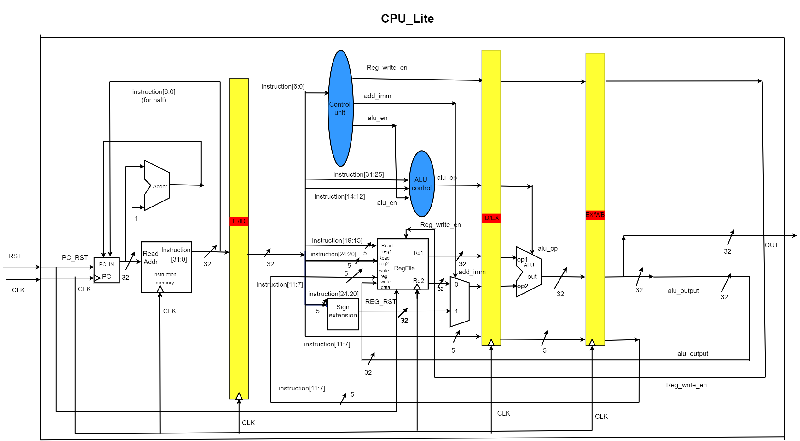
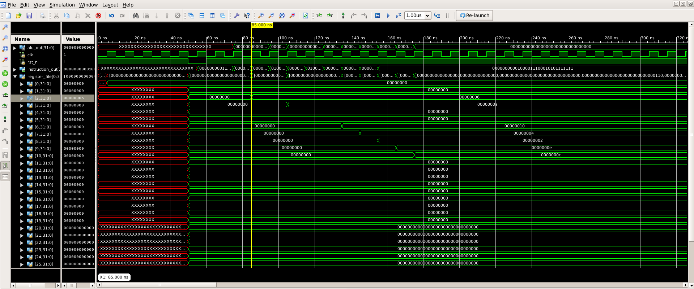
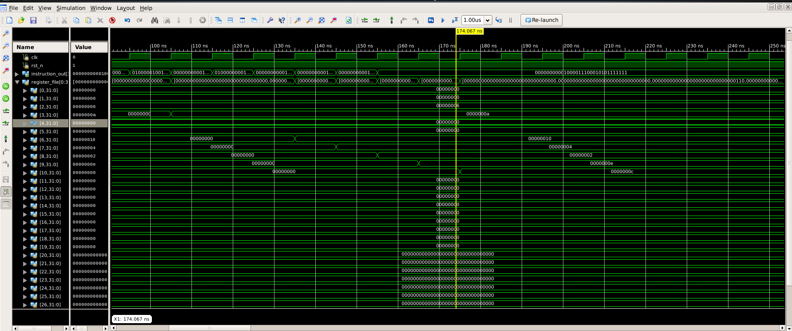
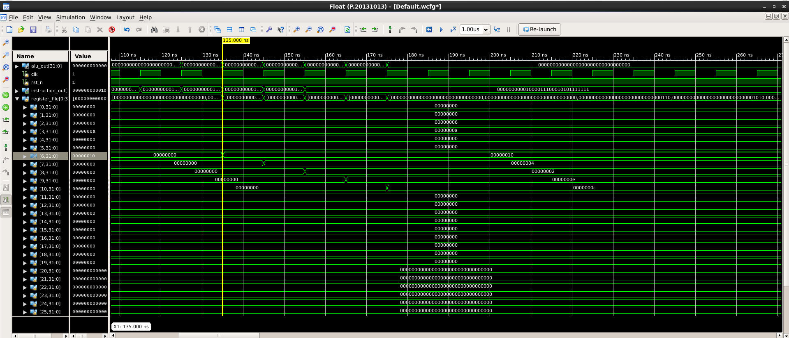
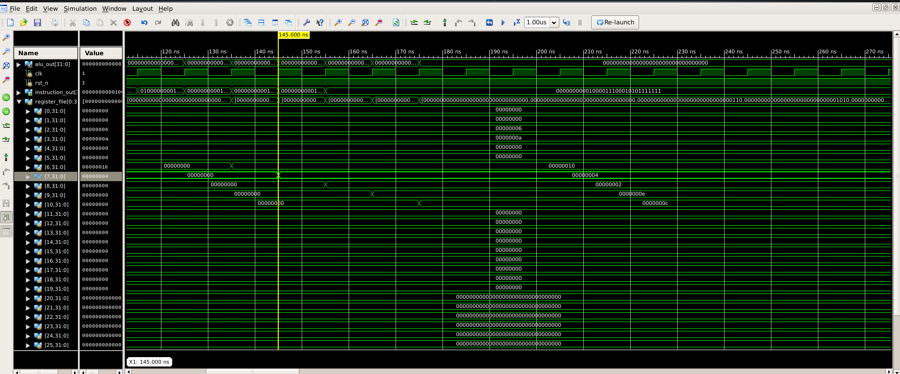
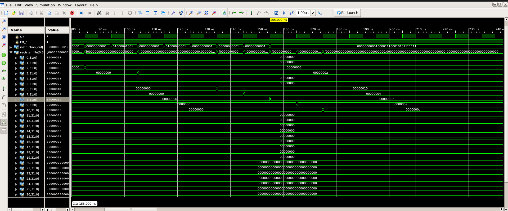
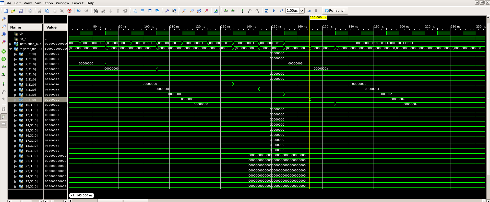
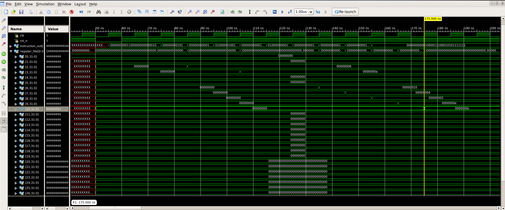
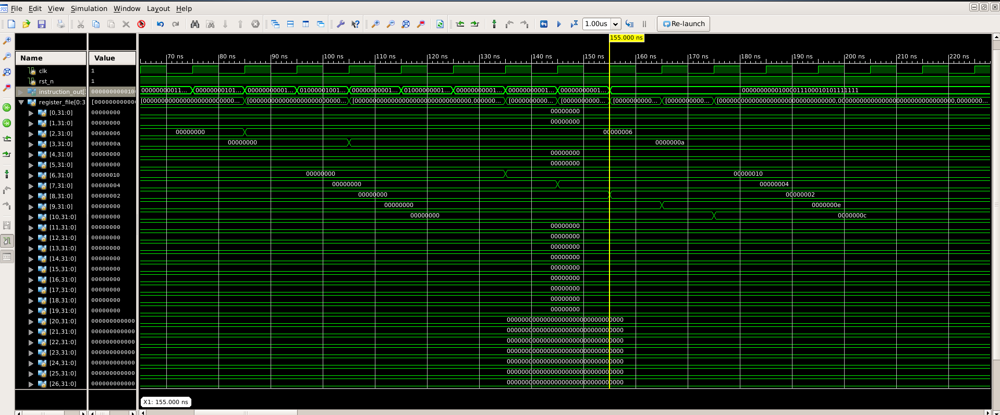

# Multi-Cycle Pipelined RISC-V Based Processor

## Team: 10  
**Version 2.0**  
_Last Updated: 13-September-2024_  

---

## Table of Contents
1. [Design Overview](#design-overview)
   - [Introduction to RISC-V Processor](#introduction-to-risc-v-processor)
   - [Project Overview](#project-overview)
2. [Instruction Set](#instruction-set)
3. [Microarchitecture](#microarchitecture)
   - [Components of Pipelined RISC-V Processor](#components-of-pipelined-risc-v-processor)
4. [RTL Hierarchy](#rtl-hierarchy)
   - [Instruction Stages](#instruction-stages)
5. [Datapath for Different Instructions](#datapath-for-different-instructions)
6. [Control Unit Truth Tables](#control-unit-truth-tables)
7. [ALU Operations](#alu-operations)
8. [Simulation Waveforms](#simulation-waveforms)

---

## Design Overview

### Introduction to RISC-V Processor
The **RISC-V (RV32I)** instruction set uses 32-bit instructions format. The architecture has **32 general-purpose registers**, where register 0 is always set to zero, and a 32-bit **program counter (PC)** increments word-aligned instructions. The processor supports six instruction formats.

### Project Overview
This project involves the design and simulation of a **4-stage pipelined RISC-V processor**. The stages are:
- Fetch
- Decode
- Execute
- Write Back

Since all the instructions in the design specification do not access data memory the memory access stage is not required

The processor supports ALU operations like **ADD, SUB, AND, OR, XOR, NOP,ADDI**. The final design is tested through a **testbench**.

---

## Instruction Set

### ALU Instructions
| Instruction | Func7  | Func3 | RS1     | RS2     | RD      | Opcode  |
|-------------|--------|-------|---------|---------|---------|---------|
| ADD         | 0000000| 000   | R0-R32  | R0-R32  | R0-R32  | 0110011 |
| SUB         | 0100000| 000   | R0-R32  | R0-R32  | R0-R32  | 0110011 |
| AND         | 0000000| 110   | R0-R32  | R0-R32  | R0-R32  | 0110011 |
| OR          | 0000000| 111   | R0-R32  | R0-R32  | R0-R32  | 0110011 |
| XOR         | 0000000| 100   | R0-R32  | R0-R32  | R0-R32  | 0110011 |

### ADDI Instruction
| Field    | Value     |
|----------|-----------|
| Opcode   | 1110011   |
| Func7    | 0000000   |
| Immediate Value | 5-bit Value |
| RD       | R0-R32    |

### HALT Instruction
| Field    | Value     |
|----------|-----------|
| Opcode   | 1111111   |
| Func7    | 0000000   |
| Status   | PC Stops  |

---

## Microarchitecture

### Components of Pipelined RISC-V Processor
1. **Program Counter (PC):** Holds the address of the next instruction to be executed.
2. **Program Memory:** Stores the instructions for execution.
3. **Register File:** Contains 32 registers (32-bit each) used for storing operands and operation results.
4. **Arithmetic Logic Unit (ALU):** Handles arithmetic and logical operations.
5. **Control Unit:** Manages control signals and determines the DataPath configuration.

---

## RTL Hierarchy

The processor is divided into three stages:
- **Instr_fetch:** Retrieves the next instruction from memory.
- **Instr_decode:** Decodes the instruction.
- **Instr_execution:** Executes the decoded instruction.

Each stage has a dedicated clock, with registers in between the stages to store intermediate results for the pipeline.

---

## Datapath for Different Instructions

1. **ALU Instructions:** Handles operations like ADD, SUB, AND, OR, and XOR.
2. **ADDI Instruction:** Adds an immediate value to a register.
3. **Halt Instruction:** Stops the program counter and halts CPU execution.

---

## Control Unit Truth Tables

### Main Control Unit
| Opcode      | ADD_IMM | REG_WRITE_EN | ALU_EN |
|-------------|---------|--------------|--------|
| 7'b0110011  | 0       | 1            | 1      |
| 7'b1110011  | 1       | 1            | 1      |
| Default     | 0       | 0            | 0      |

### ALU Control Unit
| Func7    | Func3    | ALU Operation  |
|----------|----------|----------------|
| 0000000  | 000      | ADD            |
| 0100000  | 000      | SUB            |
| 0000000  | 110      | AND            |
| 0000000  | 111      | OR             |
| 0000000  | 100      | XOR            |

---

## ALU Operations

| ALU Operation | Description      |
|---------------|------------------|
| 3’d0          | Addition         |
| 3’d1          | Subtraction      |
| 3’d2          | Bitwise AND      |
| 3’d3          | Bitwise OR       |
| 3’d4          | Bitwise XOR      |

---

## Simulation Waveforms

The following are waveforms from the simulated ALU operations:

1. **ADD Immediate Operation**  
   OPERATION: `R2 = R0 + 6`  
   INSTRUCTION FORMAT: `32'b0000000_00110_00000_000_00010_1110011`  
   

2. **NOP Operation**  
   OPERATION: `NOP`  
   

3. **ADD Operation**  
   OPERATION: `R6 = R3 + R2`  
   INSTRUCTION FORMAT: `32'b0000000_00010_00011_000_00110_0110011`  
   

4. **SUB Operation**  
   OPERATION: `R7 = R3 - R2`  
   INSTRUCTION FORMAT: `32'b0100000_00010_00011_000_00111_0110011`  
   

5. **AND Operation**  
   OPERATION: `R8 = R3 & R2`  
   INSTRUCTION FORMAT: `32'b0000000_00010_00011_110_01000_0110011`  
   

6. **OR Operation**  
   OPERATION: `R9 = R3 | R2`  
   INSTRUCTION FORMAT: `32'b0000000_00010_00011_111_01001_0110011`  
   

7. **XOR Operation**  
   OPERATION: `R10 = R3 ^ R2`  
   INSTRUCTION FORMAT: `32'b0000000_00010_00011_100_01010_0110011`  
   

8. **Halt Operation**  
   OPERATION: `Halt the CPU`  
   Program memory: `32'b0000000_00010_00011_100_01010_1111111`  
   

---

## Conclusion

This multi-cycle pipelined RISC-V processor design successfully simulates various ALU and control instructions, allowing for efficient instruction execution through pipelining. Future work may include optimization and addition of more complex instructions.
